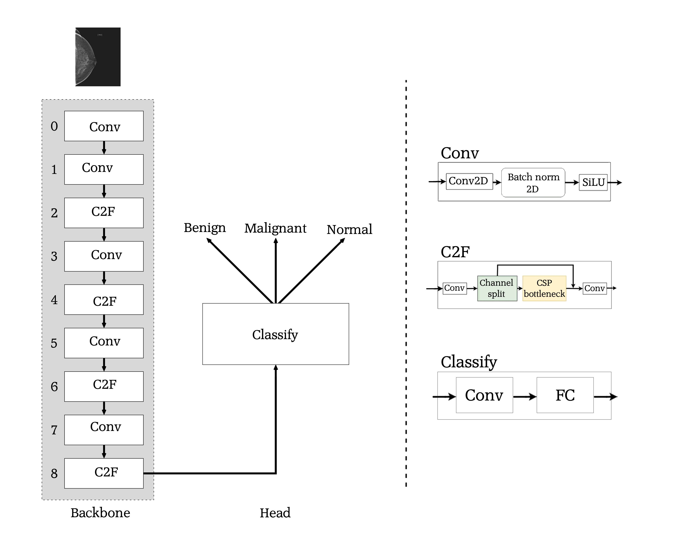

# Benchmarking YOLOv8 for Breast Cancer Classification

This repository contains the code and resources for our paper titled "Benchmarking the YOLOv8 Model for Multi-Center Breast Cancer Classification Using a Large-Scale Dataset."

## Overview

The YOLOv8 model was fine-tuned on a large-scale medical dataset for breast cancer classification. We utilized Grad-CAM (Gradient-weighted Class Activation Mapping) to visualize the important regions in the input images that influenced the model's decisions, enhancing interpretability and trustworthiness.

The YOLOv8 model architecture used in this project is shown in the following figure:

## Demo Video

For a visual demonstration of the model's inference and Grad-CAM visualizations, please refer to the following video:

[Demo Video](docs/inference.mp4)
